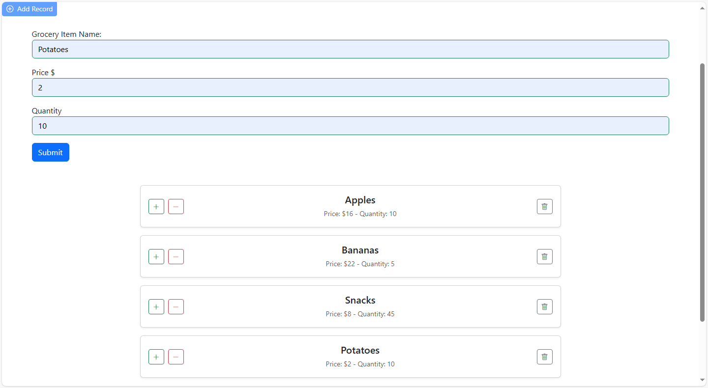

# 🛒 Grocery Shopping App

A simple **Grocery Shopping App** built using **Vanilla JavaScript** and **Bootstrap** for learning.  
The application demonstrates DOM manipulation, event handling, and dynamic UI updates without the use of frameworks.

---

## 🚀 Features

- **Render Grocery Items**  
  - Displays a list of grocery items stored in an array.  
  - Each item card shows the **name, price, and quantity**.  

- **Footer Banner**  
  - Displays the **total price** and **total quantity** of all items.  
  - Updates automatically as items are added, removed, or modified.  

- **Item Controls**  
  - `+` button → Increases item quantity (updates both item and footer totals).  
  - `-` button → Decreases item quantity (updates both item and footer totals).  
  - 🗑️ **Trash button** → Deletes the item card from the list.  

- **Add Record Form**  
  - **"Add Record" button** at the top opens a form.  
  - Submitting the form adds a **new grocery item card** dynamically.  

- **Single File Implementation**  
  - Entire functionality is implemented in a single file: `index.html` (~354 lines of code).  

---

## 📸 Screenshots

---

## 🛠️ Tech Stack

- **HTML5**  
- **CSS3 (Bootstrap 5)**  
- **JavaScript (ES6)**  

---

